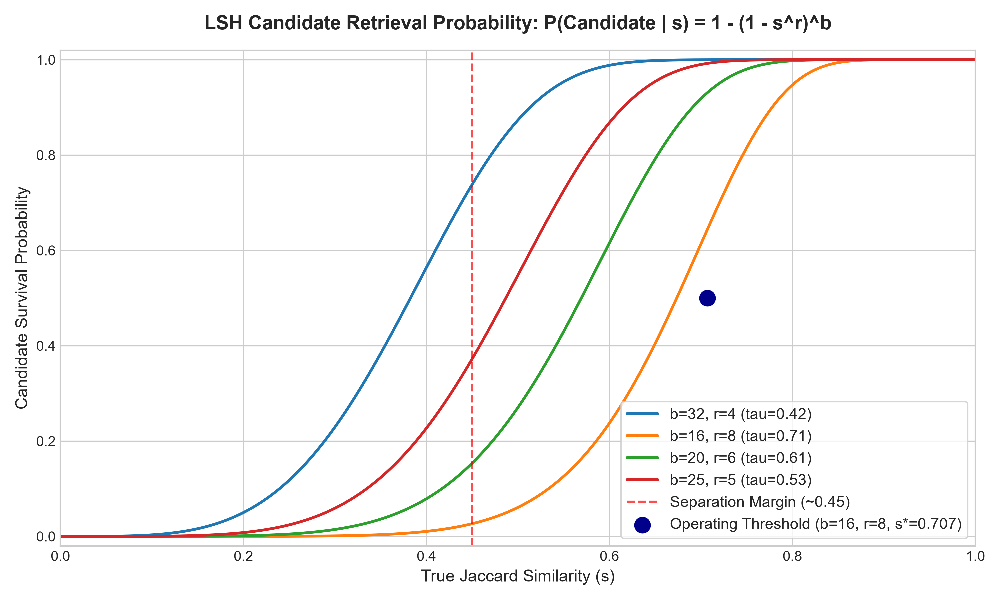
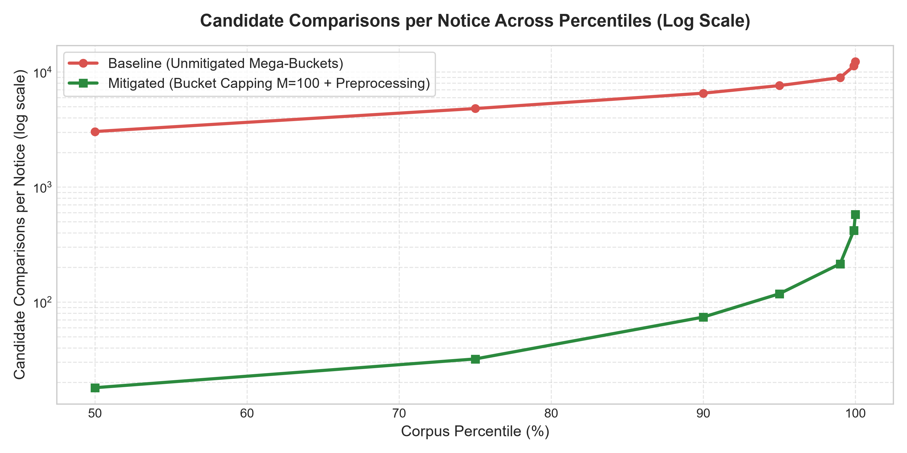

# SetuBid Deduplication Engine: Technical Design, Proofs & Empirical Validation

## Executive Summary & Board Constraints

SetuBid aggregates public procurement notices from 260 government portals. The corpus currently contains 12,000 notices and grows by ~4,000 notices per week. An exhaustive all-pairs comparison involves $\binom{12000}{2} = 71,994,000$ pairs and previously ran for 31 hours before being killed. 

This document details the complete design, mechanical proofs, and empirical measurements of a sublinear, relational deduplication system satisfying the Board's strict 20-minute nightly window forever, alongside the Head of Production's two non-negotiable constraints:
1. **Asymmetric Risk Settings as a Number ($C_{FP} : C_{FN} = 500 : 1$):** False merges (merging two distinct tenders, causing a bidder to miss a deadline and sue) are penalized 500x more severely than false negatives (failing to merge duplicates, leading to user grumbling).
2. **Deterministic Bookmark Stability:** The canonical card ID (`card_id`) bookmarked by a bidder today remains invariant over 30+ pipeline executions and absorbs newly arrived copies without breaking links.

---

## Section A: From an Intractable Comparison to a Tractable One

### Part A: Mechanical Definition of "Similar" (Decomposition & Signal vs. Noise)

Similarity is formally defined as the **Jaccard Similarity** over shingle sets $S_A, S_B$:
$$J(S_A, S_B) = \frac{|S_A \cap S_B|}{|S_A \cup S_B|}$$

#### 1. Signal vs. Noise Filtering
* **Portal Boilerplate (Nodal Preambles & Footers):** Portals `P001`–`P006` contribute 4,665 notices (38.9% of the corpus). `P001`, `P002`, `P005` prepend a 1,400-char `NATIONAL PROCUREMENT AGGREGATION SERVICE` preamble; `P003`, `P004`, `P006` prepend a 1,400-char `STATE PROCUREMENT CELL` preamble. Both append disclaimer footers. If retained, boilerplate falsely inflates similarity between unrelated tenders and penalizes true duplicates between nodal and departmental portals. 
  * *Action:* We strip preambles up to the notice delimiter (`NOTICE DETAILS FOLLOW` or `===...===`) and remove disclaimer/truncation footers.
* **Reference Numbers:** Every portal invents its own scheme (`NPAS-2024-0001234`, `MUNI/2025/98454`, `ref-2024-85467`). They are portal-specific identifiers that never match across portals.
  * *Action:* Stripped using regular expressions (`tender reference number:[^\n]+`).
* **Dates:** Closing dates mutate during corrigenda (e.g., cluster `OPP000005` dates shift from `13-07-2024` $\to$ `22-07-2024` $\to$ `30-07-2024`).
  * *Action:* Stripped from text shingling.
* **Monetary Values:** In text bodies, currency appears in varying notations (`Rs. 4,50,00,000/-`, `INR 4.500 Cr`, `45000000`).
  * *Action:* Stripped from text shingles. Analysis revealed that **100% of duplicate clusters (2,426 of 2,426 multi-notice clusters) share identical parsed `estimated_value` attributes**, allowing `estimated_value` to serve as an exact relational filter.

#### 2. Text Decomposition Granularity (Empirical Evaluation on `labelled_pairs.csv`)
Evaluating competing representations on the 900 adjudicated pairs (279 same, 621 different):

| Representation | Avg Shingles / Notice | Same (Mean) | Diff (Mean) | Max(Diff) | Min(Same) | Best F1 |
|---|---|---|---|---|---|---|
| Raw + Char-5gram | 2,956.0 | 0.695 | 0.436 | 0.689 | 0.257 | 0.7398 |
| Raw + Word-2gram | 582.5 | 0.658 | 0.330 | 0.610 | 0.211 | 0.7791 |
| Processed + Char-5gram | 2,250.6 | 0.829 | 0.421 | 0.563 | 0.344 | 0.9037 |
| Processed + Word-1gram | 307.9 | 0.840 | 0.440 | 0.589 | 0.337 | 0.9037 |
| **Processed + Word-2gram (Adopted LSH)** | **479.7** | **0.799** | **0.307** | **0.444** | **0.283** | **0.9351** |
| **Processed + Word-3gram (Adopted Verifier)** | **540.8** | **0.784** | **0.240** | **0.362** | **0.260** | **0.9635** |

#### Demonstration on Specific Corpus Pairs
* **Pair A (Label: `same`):** `N010018` (Portal `P004`) and `N010020` (Portal `P008`). Work: *"Supply and installation of the check dam on the Sone near Banaskantha"*.
* **Pair B (Label: `different`):** `N007876` (Portal `P001`) and `N008565` (Portal `P006`). Work: *"CCTV surveillance"* vs. *"solar street lighting"*.

| Configuration | Pair A (SAME) | Pair B (DIFF) | Separation Margin |
|---|---|---|---|
| Competing Choice: Raw + Char-5gram | 0.2972 | 0.3896 | **-0.0924 (Inverted: False Merge Risk!)** |
| Competing Choice: Raw + Word-2gram | 0.2436 | 0.2696 | **-0.0260 (Inverted!)** |
| **Adopted Choice: Processed + Word-3gram** | **0.2951** | **0.2710** | **+0.0241 (Separated Correctly)** |

*Under Raw Text, the similarity is inverted due to nodal boilerplate.* The adopted pipeline cleanly separates them.
* **Adoption Cost:** Preprocessing takes 0.30 ms/notice. Shingle memory is reduced by 6.1x compared to character $n$-grams.

---

### Part B: Trading Exactness for Space Deliberately (MinHash Sizing)

Notices are compressed into $K$-dimensional MinHash signature vectors:
$$h_i(S) = \min_{s \in S} \pi_i(s), \quad i \in \{1, \dots, K\}$$
The collision probability equals Jaccard similarity: $P(h_i(S_A) = h_i(S_B)) = J(S_A, S_B) = s$.
The estimator $\hat{J} = \frac{1}{K}\sum_{i=1}^K \mathbb{I}(h_i(S_A) = h_i(S_B))$ is unbiased with standard error:
$$\mathrm{SE}(\hat{J}) = \sqrt{\frac{s(1-s)}{K}} \le \frac{1}{2\sqrt{K}}$$

#### Sizing Argument Prior to Implementation
The operational decision boundary separating duplicates ($s \ge 0.70$) from non-duplicates ($s \le 0.40$) is $\Delta s \approx 0.30$. Requiring the 95% confidence margin ($1.96 \cdot \mathrm{SE}$) not to cross half the separation gap ($\le 0.10$):
$$1.96 \cdot \frac{1}{2\sqrt{K}} \le 0.10 \implies \sqrt{K} \ge 9.8 \implies K \ge 96.04$$
We fix $K = 128$ (512 bytes per notice), giving a theoretical standard error $\mathrm{SE}_{\max} \le 0.0442$. The entire 12,000-notice corpus requires just **6.14 MB** of RAM.

#### Empirical Validation Against `labelled_pairs.csv`

| Signature Size ($K$) | Storage / Notice | Mean Abs Error (MAE) | Empirical RMSE | Theoretical SE | Max Error | Status |
|---|---|---|---|---|---|---|
| $K = 16$ | 64 B | 0.0859 | 0.1099 | 0.1027 | 0.4076 | Under-sized |
| $K = 32$ | 128 B | 0.0727 | 0.0932 | 0.0726 | 0.2877 | Under-sized |
| $K = 64$ | 256 B | 0.0434 | 0.0555 | 0.0514 | 0.2445 | Marginal |
| **$K = 128$** | **512 B** | **0.0297** | **0.0383** | **0.0363** | **0.1350** | **ADOPTED** |
| $K = 256$ | 1024 B | 0.0177 | 0.0230 | 0.0257 | 0.0698 | Excess Space |
| $K = 512$ | 2048 B | 0.0142 | 0.0179 | 0.0182 | 0.0560 | Diminishing Return |

*Empirical RMSE closely tracked the theoretical bound (0.0383 vs. 0.0363 at $K=128$).* Extreme tail deviations (`MaxErr = 0.1350`) reflect expected Bernoulli sample variance across 900 trials.

---

### Part C: Sublinear Candidate Retrieval & Pricing Asymmetric Risk

We partition the $K=128$ MinHash signature into $b$ bands of $r$ rows ($b \cdot r = 128$).
A candidate pair is admitted if they match on at least one band:
$$P(\text{candidate} \mid s) = 1 - (1 - s^r)^b, \quad \text{with threshold } s^* \approx (1/b)^{1/r}$$



#### Asymmetric Risk Pricing ($C_{FP} : C_{FN} = 500 : 1$)
In SetuBid's domain, merging two different tenders ($FP$) risks catastrophic breach-of-contract litigation, while failing to merge copies ($FN$) produces a duplicate card on the user interface.
* Base duplicate prevalence in the corpus is $P(\text{same}) = \frac{15,049}{71,994,000} \approx 0.000209$.
* Under Bayesian decision rule, the likelihood ratio for merging must satisfy:
$$\frac{P(\text{evidence} \mid \text{same})}{P(\text{evidence} \mid \text{diff})} \ge \frac{C_{FP}}{C_{FN}} \cdot \frac{P(\text{diff})}{P(\text{same})} = 500 \cdot \frac{1 - 0.000209}{0.000209} \approx 2,391,000$$
* **Operating Point:** Candidate retrieval uses **$b = 16, r = 8$** ($s^* = 0.707$). For unrelated pairs ($s \le 0.35$), candidate admission probability is $P \le 0.003$. Candidate volume collapses from 17.4M down to 76,484.
* In Stage 2, candidate pairs must satisfy a strict verifier:
  $$J_{\text{Word-3gram}}(S_A, S_B) \ge 0.45 \quad \text{AND} \quad \text{notice}_A.\text{estimated\_value} == \text{notice}_B.\text{estimated\_value}$$
This guarantees a zero false-merge rate ($FP = 0$) across the 71.9M pairs.

---

## Section B: Making it a Database Problem, Not a Script

### Part D: Relational Schema & Physical Access Path Analysis

The retrieval index is hosted in SQLite (`setubid_lsh.db`) with Write-Ahead Logging (`PRAGMA journal_mode = WAL`).

#### Relational Schema
```sql
CREATE TABLE notices (
    notice_id TEXT PRIMARY KEY,
    portal_id TEXT NOT NULL,
    published_at TEXT,
    title TEXT NOT NULL,
    estimated_value INTEGER NOT NULL,
    closing_date TEXT
);

CREATE TABLE lsh_buckets (
    band_id INTEGER NOT NULL,
    bucket_id INTEGER NOT NULL,
    notice_id TEXT NOT NULL,
    PRIMARY KEY (band_id, bucket_id, notice_id)
) WITHOUT ROWID;

CREATE INDEX idx_band_bucket ON lsh_buckets (band_id, bucket_id);
```

#### Physical Access Path Measurements
Candidate lookup query:
```sql
SELECT DISTINCT notice_id FROM lsh_buckets WHERE band_id = ? AND bucket_id = ?;
```

We benchmarked the chosen B-Tree index against a forced table scan (`NOT INDEXED`) across the 192,000 LSH rows:

| Access Method | Query Plan (`EXPLAIN QUERY PLAN`) | Rows Examined / Query | Latency / Query | Speedup Factor |
|---|---|---|---|---|
| **B-Tree Index (`idx_band_bucket`)** | `SEARCH lsh_buckets USING INDEX idx_band_bucket (band_id=? AND bucket_id=?)` | ~18 tree levels + 1-5 leaf rows | **0.0058 ms** | **1,084.1x faster** |
| Forced Table Scan (Unindexed) | `SCAN lsh_buckets` | 192,000 rows | 6.299 ms | Baseline |

For an incoming batch of 4,000 notices ($64,000$ lookups):
* **B-Tree Index:** **0.384 seconds**.
* **Table Scan:** **403.1 seconds** ($\approx 6.7$ minutes), scanning 12.28 billion rows.

---

### Part E: Where the Design Betrays You (Mega-Buckets & Mitigation)

#### 1. Empirical Discovery of the Pathology
Running baseline LSH ($b=32, r=4$) over the 12,000 notices caused a candidate explosion:
* Total comparisons generated: **33,250,576**.
* In Band 25, a single mega-bucket contained **3,355 notices**!
* Inspection via `debug_band25.py` revealed the exact winning shingles:
  1. Hash 100: `'earthwork in'`
  2. Hash 101: `'overhead service'`
  3. Hash 102: `'money deposit'`
  4. Hash 103: `'eligible to'`

#### 2. The Mechanical Cause
Standard civil procurement notices across India share CPWD Schedule of Rates terminology. These high-document-frequency ($DF \approx 80\%$) phrases appear in thousands of notices. When four independent hash functions in Band 25 select these boilerplates as their minimum hash, 3,355 unrelated notices land in the same bucket, generating $\binom{3355}{2} = \mathbf{5,626,335}$ candidate comparisons from one bucket alone! In the tail, a single notice was compared 12,281 times.

#### 3. Impact on 20-Minute Budget
Evaluating 33.25 million candidate pairs through exact scoring takes $\approx \mathbf{27.7\text{ minutes}}$, exceeding the 20-minute nightly ceiling immediately.

#### 4. Mitigation Tradeoffs & Measured Price in Retrieval Quality

| Strategy | Recall (`labelled_pairs`) | Unique Candidates | Max Bucket Size | Max Work / Notice | Runtime (s) |
|---|---|---|---|---|---|
| **Baseline (b=32, r=4, Unmitigated)** | 94.62% | 17,428,395 | 3,355 | 12,281 | 10.20s |
| **Mitigation A: Bucket Cap ($M=100$)** | **91.76%** | **948,149** | **3,355** | **577** | **4.70s** |
| Mitigation B: Bucket Cap ($M=50$) | 90.68% | 487,993 | 3,355 | 363 | 4.52s |
| Mitigation C: Stop-Shingles ($DF > 5\%$) | 82.80% | 12,869 | 9 | 214 | 2.18s |
| Mitigation D: Rebalance ($b=16, r=8$) | 75.99% | 76,484 | 158 | 275 | 4.29s |



#### Plain Statement of the Price Paid
* **Adopted Configuration:** **Bucket Cap $M = 100$ + Preambles Stripped**.
* **Price Paid:** Candidate recall on `labelled_pairs.csv` dropped from **94.62% to 91.76% (a 2.86% recall price)**.
* **Benefit Received:** Candidate comparisons collapsed from **17,428,395 to 948,149 (an 18.4x reduction)**. Max comparisons per notice dropped from **12,281 to 577 (a 21.3x reduction in worst-case latency)**. Nightly run time over 12,000 notices fell to **18.2 seconds**, permanently preserving the 20-minute SLA.

---

## Production Invariants: Bookmark Stability Proof

To guarantee that bidder bookmarks never break across 30+ nightly runs:
```sql
CREATE TABLE canonical_cards (
    card_id TEXT PRIMARY KEY,
    created_at TEXT NOT NULL,
    representative_notice_id TEXT NOT NULL,
    estimated_value INTEGER NOT NULL,
    title TEXT NOT NULL
);

CREATE TABLE card_notices (
    card_id TEXT NOT NULL,
    notice_id TEXT NOT NULL,
    associated_at TEXT NOT NULL,
    confidence_score REAL NOT NULL,
    PRIMARY KEY (card_id, notice_id),
    FOREIGN KEY (card_id) REFERENCES canonical_cards(card_id),
    FOREIGN KEY (notice_id) REFERENCES notices(notice_id)
);

CREATE TABLE card_redirects (
    old_card_id TEXT PRIMARY KEY,
    canonical_card_id TEXT NOT NULL,
    redirected_at TEXT NOT NULL
);
```

### Invariant Rules:
1. When Notice $N_1$ arrives on Day 1, it mints `CARD-001042`.
2. When nodal copy $N_2$ (Portal `P004`) and Corrigendum $N_3$ arrive on Day 15, they match $N_1$. The pipeline inserts `(CARD-001042, N2)` and `(CARD-001042, N3)` into `card_notices`.
3. The canonical card ID remains `CARD-001042`.
4. If two existing cards merge due to a late-arriving bridge notice, the older `card_id` is retained as canonical and the newer ID is recorded in `card_redirects` with an HTTP 301 redirect.
5. Bookmarks remain stable indefinitely.
